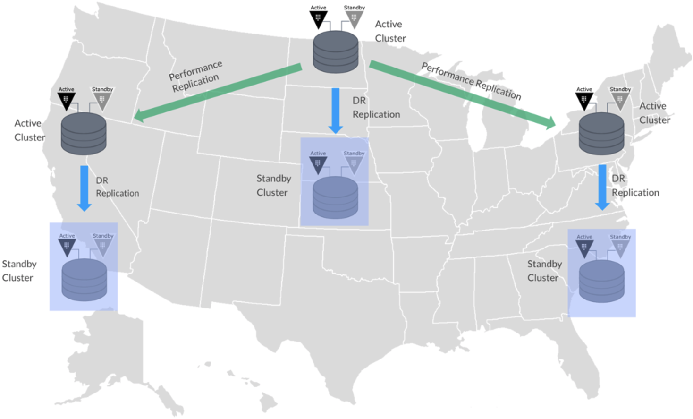

name: chapter-1
class: title, shelf, no-footer, fullbleed
background-image: url(https://hashicorp.github.io/field-workshops-assets/assets/bkgs/HashiCorp-Title-bkg.jpeg)
count: false

# Capítulo 1  
## HashiCorp Vault Overview

???
Chapter 1 introduces Vault

---
name: hashiCorp-vault-overview
# HashiCorp Vault Overview

  * HashiCorp Vault é um sistema de segredos API-driven e cloud agnostic.
  * Permite guardar e gerenciar segredos de maneira segura em ambientes de nuvem híbridos.
  * Pode ser usado também para gerar credenciais de vida curta ou dados criptografados para aplicações on the fly.

???
This is meant as a high level overview.  For detailed descriptions or instructions please see the docs, API guide, or learning site:
* https://www.vaultproject.io/docs/
* https://www.vaultproject.io/api/
* https://learn.hashicorp.com/vault/

---
name: the-old-way
layout: false
# O Modelo de Segurança Tradicional
.center[]
.center[Também conhecido como o método "Castelo e Fosso".]

???
* This picture shows the traditional castle and moat security model.

---
layout: true

.footer[
- Copyright © 2021 HashiCorp
- 
]

---
name: traditional-security-models
# O Modelo de Segurança Tradicional
* Modelos de segurança tradicionais foram construídos sob a ideia de uma segurança baseada em perímetro.
* Na ponta deveria haver um firewall, e dentro do que é protegido pelo firewall, assumia-se que tudo estava seguro.
* Recursos como bancos de dados eram meramente estáticos. Como também regras baseadas em endereços IPs, credenciais presentes no código-fonte ou mantida em arquivos estáticos no disco.
???
This slide discusses the traditional security model

---
name: problems-with-traditional-security-models
# Problemas com o Modelo Tradicional
* Regras baseadas em endereços IP
* Credenciais Hardcoded, que consequentemente leva a problemas, como:
  * Service Accounts compartilhadas entre aplicações e usuários
	* Difícil de rotacionar e determinar quem tem acesso
	* Revocação de credenciais comprometidas (vazadas) pode quebrar o funcionamento

???
* This slide describes some of the problems with the traditional security model.
---
name: the-new-way
layout: false
# Gerenciamento de Segredos Moderno
.center[]
.center[Sem perímetro definido; segurança garantida pela identidade (identity based security).]

???
* These are Mongolian Yurts or "Ger" as they are called locally. Instead of a castle with walls and a drawbridge, a fixed fortress that has an inside and an outside, these people move from place to place, bringing their houses with them.

* And if you don't think the Nomadic way can be an effective security posture, think about this for a moment. The Mongol military tactics and organization enabled the Genghis Khan to conquer nearly all of continental Asia, the Middle East and parts of eastern Europe. Mongol warriors would typically bring three or four horses with them, so they could rotate through the horses and go farther. Mongol army units could move up to 100 miles a day, which was unheard of in the 13th century. They were faster, more adaptable, and more resilient than all their enemies.

---
name: identity-based-security-1
#Identity Based Security
.center[]
.center[[Identity Based Security and Low Trust Networks](https://www.hashicorp.com/identity-based-security-and-low-trust-networks)
]

???
* Here we see that Vault has multiple means of authenticating users and applications with its Auth Methods.
* Vault can manage many types of secrets and excels at generating short-lived, dynmamic secrets.
* Vault's ACL policies are associated with tokens that users and applications use to access secrets after authenticating.
* Tokens can only read/write secrets that its policies allow.
* Click on the link to read a white paper about identity-based security in low trust networks.

---
layout: true

.footer[
- Copyright © 2021 HashiCorp
- 
]

---
name: identity-based-security-2
# Identity Based Security

Vault foi projetado para contemplar as necessidades de segurança de aplicações modernas. Difere-se da abordagem tradicional, através do uso de:

* Identity based rules permitindo segurança além de perímetros da rede
* Credenciais dinâmicas, de vida curta, que são rotacionadas (mudadas) frequentemente
* Contas individuais para manter o rastreamento
* Credenciais e entidades que podem ser facilmente invalidadas

???
* This slide discusses how Vault is designed for modern applications.

---
name: secrets-engines
layout: false
# Vault Secrets Engines
.center[]
.center[[Vault Secrets Engines](https://www.vaultproject.io/docs/secrets/)]

???
* Vault provê várias secret engines out-of-the-box.
* Secrets engines adicionais (personalizadas) podem ser adicionadas por clientes.
* Clique no link para saber mais sobre Vault secrets engines.

---
name: vault-reference-architecture-1
# Vault - Componentes Internos
.center[]
.center[[HashiCorp Vault Internals Architecture](https://www.vaultproject.io/docs/internals/architecture/)
]

???
* Clique no link para saber mais sobre os componentes internos da arquitetura do Vault's.

---
name: vault-reference-architecture-2
# Vault - Arquitetura - Alta Disponibilidade
.center[]
.center[[Vault High Availability](https://www.vaultproject.io/docs/concepts/ha/)
]

???
* Vault permite que múltiplos servidores sejam combinados num cluster de alta disponibilidade dentro de uma mesma região de nuvem ou de um datacenter fixo combinados.
* Clique no link para saber mais sobre a arquitetura de alta disponibilidade do Vault num cluster unificado.

---
name: vault-reference-architecture-3
# Vault - Arquitetura - Multi-Região
.center[]
.center[[Vault Enterprise Replication](https://www.vaultproject.io/docs/enterprise/replication/)
]

???
* Vault versão Enterprise suporta replicação entre clusters de diferentes regiões e data centers.
* Suporta também recuperação de desastres e replicação de desempenho.
* Estes podem ser utilizados em conjunto.
* Clique no link para saber mais sobre replicação no Vault's.

---
layout: true

.footer[
- Copyright © 2021 HashiCorp
- 
]
