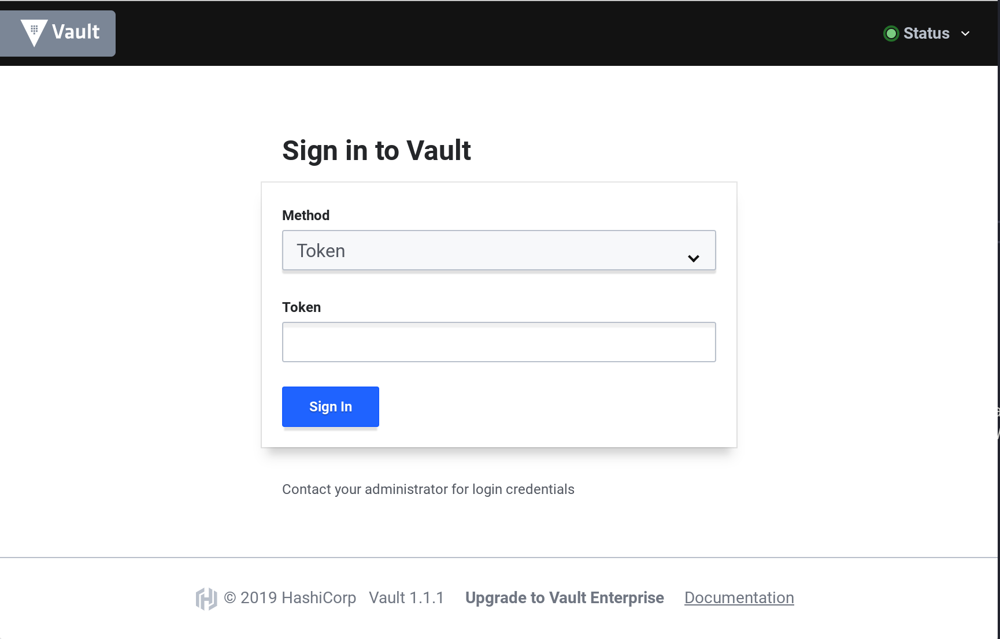
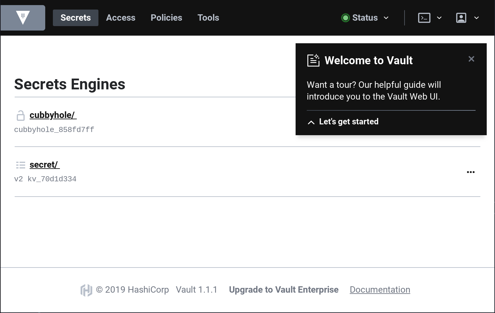

name: Chapter-2
class: title, shelf, no-footer, fullbleed
background-image: url(https://hashicorp.github.io/field-workshops-assets/assets/bkgs/HashiCorp-Title-bkg.jpeg)
count: false


# Capítulo 2      
## Interagindo com o Vault


???
Chapter 2 focuses on interacting with Vault

---
layout: true

.footer[
- Copyright © 2021 HashiCorp
- 
]

---
name: Interacting-With-Vault
# Interagindo com o Vault

Vault provê vários mecanismos para interagir com ele:
* Vault [CLI](https://www.vaultproject.io/docs/commands/index.html)
* Vault [UI](https://learn.hashicorp.com/vault/getting-started/ui)
* Vault [API](https://www.vaultproject.io/api-docs/index/)

???

* Chapter 2 focuses on interacting with Vault

---
name: Vault-CLI
# Vault CLI
* Vault CLI é uma aplicação em Go.
* Roda no macOS, Windows, Linux, e outros sistemas operacionais.
* Você pode baixar a versão mais recente [aqui](https://www.vaultproject.io/downloads/).

???
* The Vault CLI is distributed as a Go binary.
* It runs on multiple operating systems.

---
name: installing-Vault-CLI
# Instalando a Vault CLI
* Instalar a Vault no seu computador é fácil:
  * Faça download do arquivo zip.
  * Descompact o binário `vault`.
  * Coloque o binário no seu path.

Veja este [tutorial](https://learn.hashicorp.com/vault/getting-started/install) para mais detalhes.

???
Installing Vault is easy.

---
name: some-cli-commands
# Alguns comandos básicos da Vault CLI
* `vault` por si só já irá fornecer uma lista de vários comandos da CLI
  * A lista inicia com os mais comuns.
* `vault version` informa qual a versão do Vault que você está rodando
* `vault read` é usado para ler segredos do vault
* `vault write` é usado para escrever segredos no Vault.

As flags `-h`, `-help`, e `--help` podem ser adicionadas para obter ajuda sobre qualquer comando da CLI.

???
Let's discuss some of the basic Vault CLI commands.

---
name: vault-server-modes
# Vault Server Modes
Servidores Vault podem rodar em dois modos diferentes:
* Modo "Dev", que é recomendado apenas para desenvolvimento
* Modo "Prod", que é recomendado para testes e produção

???
* Discuss Vault's two server modes

---
name: vault-dev-server
# Vault Modo "Dev"
* Não é seguro
* Armazena todos os dados em memória
* Vault é `unsealed` automaticamente
* O token raiz (root token) pode ser especificado antes de rodar

**Cuidado: nunca guarde segredos reais num servidor rodando no modo "Dev".**

???
* Discuss limitations of Vault's "Dev" mode.
* Warn students to never store real secrets on a Dev server.

---
name: Vault-UI
# Vault UI
* Para usar Vault, você pode ser autenticar em uma interface gráfica.
* Vault suporta múltiplos métodos de autenticação.
* Um novo servidor vault irá aceitar apenas os métodos de autenticação que estejam habilitados.

???

* Let's talk about the Vault UI a bit, including ways of signing into it.
* While you used the token "root" in the last challenge, you'll be running a Vault server in "Prod"  mode in the rest of the track and will have to use the token generated when you initialize that server in the next challenge.
---
name: signing-into-the-vault-ui
# Se autenticando na UI do Vault
.center[]

???
* This slide shows a screenshot of the login dialog for the Vault server.

---
name: welcome-to-vault
# Uma tour "Welcome to Vault" 
.center[]
* Quando você se autentica no Vault, você pode seguir uma tour de boas vindas para obter uma visão geral.

???
* Explain the "Welcome to Vault" tour.
* Explain how to get rid of it.
* Point out that they can restart the tour with the "Restart guide" menu under their user icon in the upper right corner of the UI.

---
name: vault-api-1
# A Vault API

* Vault tem uma API HTTP que pode ser usada para configurar o Vault e gerenciar seus segredos.
* Você pode verificar a saúde do Vault com um simples comando `curl` seguido por `jq` para formatar a saída JSON.

Command:
```bash
curl http://localhost:8200/v1/sys/health | jq
```
???
* Let's talk about the Vault HTTP API

---
name: vault-api-2
# A Vault API

```json
{
  "initialized": true,
  "sealed": false,
  "standby": false,
  "performance_standby": false,
  "replication_performance_mode": "disabled",
  "replication_dr_mode": "disabled",
  "server_time_utc": 1557180149,
  "version": "1.4.3",
  "cluster_name": "vault-cluster-db6f271d",
  "cluster_id": "33e85d7c-63bb-7523-0165-9d1aee722d70"
}
```

???
Here is the output from Vault's sys/health endpoint

---
name: vault-api-3
# Se autenticando na Vault API

* Os endpoints sys/health não querem qualquer autenticação.
* Mas a maior parte das chamadas à API do Vault requerem autenticação.
* Isto é feito através de um token do Vault token que é fornecido no header `X-Vault-Token`.

???
* Talk about how most Vault HTTP API calls will require authentication with a Vault token.
