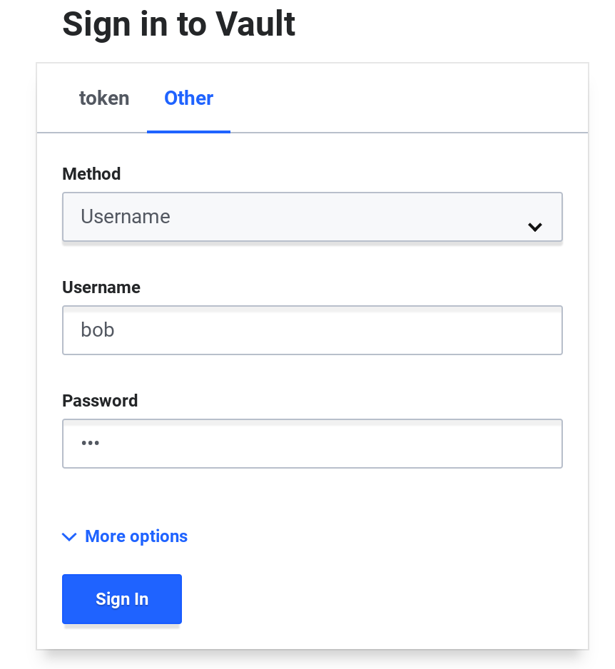

name: chapter-5
class: title, shelf, no-footer, fullbleed
background-image: url(https://hashicorp.github.io/field-workshops-assets/assets/bkgs/HashiCorp-Title-bkg.jpeg)
count: false

# Capítulo 5      
## Métodos de Autenticação

???

* Chapter 5 introduces Vault authentication methods
* It focuses on the Userpass method.

---
layout: true

.footer[
- Copyright © 2021 HashiCorp
- 
]

---
name: vault-auth-methods
# Métodos de Autenticação
.center[]
.center[Vault suporta vários métodos de autenticação diferentes.]

???
* Auth methods are how your apps and users verify their identity.
* In the same way you might present some kind of valid ID at the hotel check-in desk, users and apps provide some kind of credential or token to authenticate.
* You can enable multiple auth methods and multiple instances of the same auth method.

---
name:vault-auth-methods-2
# Principais métodos de autenticação

<u>Métodos para usuários</u>
<ul>
<li>Userpass</li>
<li>GitHub</li>
<li>LDAP</li>
<li>JWT/OIDC</li>
<li>Okta</li>
</ul>

<u>Métodos para Aplicações</u>
<ul>
<li>AppRole</li>
<li>AWS</li>
<li>Azure</li>
<li>Google Cloud</li>
<li>Kubernetes</li>
</ul>

???
* Userpass - Allows users to authenticate with username and password managed by Vault
* GitHub - Allows users to authenticate with their GitHub personal access tokens
* LDAP - Allows users to authenticate against an LDAP server with their username and password managed by that server.
* JWT/OIDC - Allows users to authenticate against an external OpenID Connect provider or with JSON Web Tokens (JWTs)
* Okta - Allows users to authenticate using Okta single sign-on.
* AppRole - Allows applications to authenticate in automated workflows using a role and a role ID.
* AWS - Allows applications on AWS EC2 instances and Lambda functions to authenticate with IAM credentials or EC2 metadata.
* Azure - Allows applications associated with Azure Managed Service Identities to authenticate using Azure Active Directory credentials.
* Google Cloud - Allows applications in GCP to authenticate using Google Cloud IAM service accounts or Google Compute Engine (GCE) metadata.
* Kubernetes - Allows Kubernetes pods to authenticate with JWT tokens.

---
name: enabling-auth-methods
# Habilitando Métodos de Autenticação

* A maioria dos métodos de autenticação do Vault precisam ser habilitados explicitamente.
* Isto é feito através do comando `vault auth enable`.
* Cada método de autenticação possui um path padrão.
* Paths alternativos podem ser especificados para habilitar múltiplas instâncias:  `vault auth enable -path=aws-east aws`
* Paths personalizados podem ser especificados nos comandos da CLI commands e chamadas de API: 
`vault write aws-east/config/root` 
invés de `vault write aws/config/root`

???

* Talk about enabling auth methods.
* Talk about default and custom paths
* Explain the examples

---
name: userpass-0
# Método de Autenticação Userpass
.center[]
* O método Userpass autentica usuários com nome de usuários e senhas gerenciados pelo Vault.
* Não é recomendado para produção, mas pode ser usado para ambientes de desenvolvimento.

???
* The Userpass method allows users to authenticate with username and password managed by Vault.
* It is not recommended for production, but it's fine for development and lab environments.
* In the real world you'd probably have Vault use your Active Directory, LDAP, GitHub, or other system of record for authentication by users.