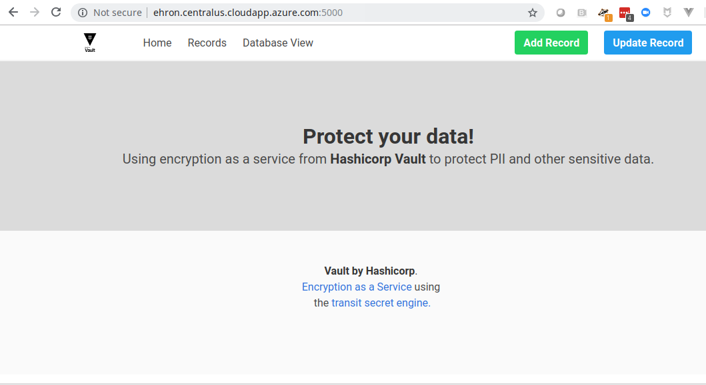
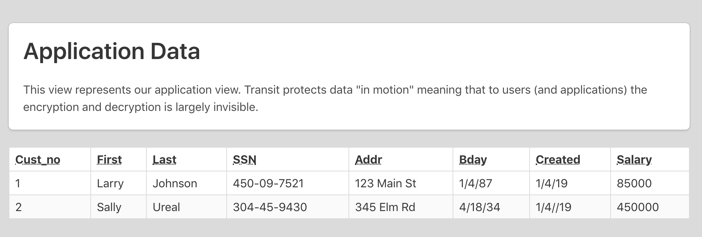
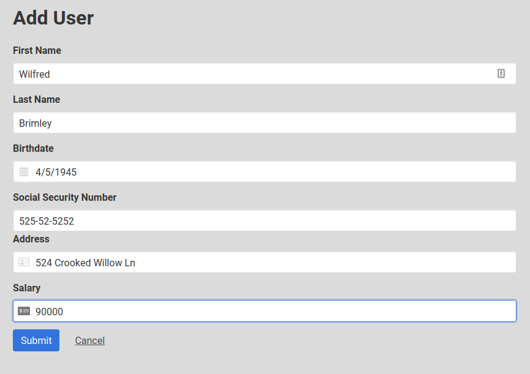
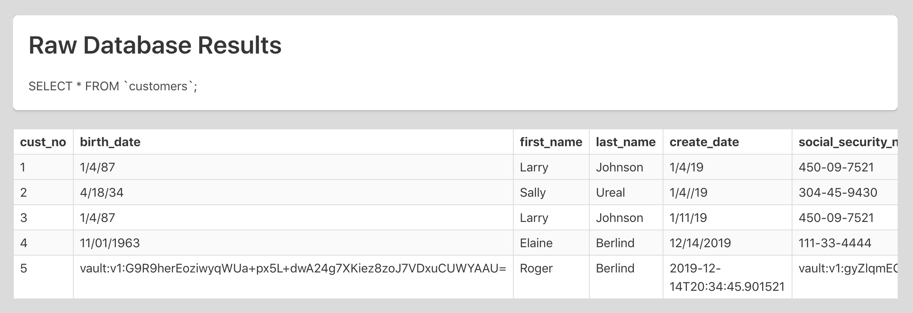

name: chapter-8
class: title, shelf, no-footer, fullbleed
background-image: url(https://hashicorp.github.io/field-workshops-assets/assets/bkgs/HashiCorp-Title-bkg.jpeg)
count: false

# Capítulo 8  
## Criptografia como um Serviço (Encryption as a Service)

???

* O Capítulo 8 introduz o uso da secrets engine Vault Transit que funciona como um Encryption-as-a-Service (EaaS).

---
layout: true

.footer[
- Copyright © 2021 HashiCorp
- 
]

---
name: Vault-Transit-Engine

# Vault Transit Engine - Encryption as a Service
.center[]

* Vault's Transit Secrets Engine atua como Encryption-as-a-Service.
* Desenvolvedorees podem usar esse recurso para criptografar e descriptografar dados fora do Vault

???
* Let's talk about Vault's Encryption-as-a-Service, the Transit secrets engine.
* It provides an encryption API & service that are secure, accessible and easy to implement.
* Instead of forcing developers to learn cryptography, we present them with a familiar API that can be used to encrypt and decrypt data that is stored outside of Vault.

---
name: transit-engine-benefits
# Transit Engine - Benefícios

* Provê aos desenvolveddores uma arquitetura bem definida para que não precisem ter expertise avançada em criptografia.
* Provê gerenciamento centralizado de chaves.
* Garante que apenas algoritmos de criptografia aprovados são utilizados.
* Suporta rotacionamento automático de chaves.
* Se invasores conseguirem acessar os dados cifrados, eles irão visualizar apenas texto criptografado que será inútil sem o Vault.

???
* There are seveal benefits of using the Transit engine.

---
name: web-app-screenshot
# Exemplo de Aplicação Web
### Exemplo de aplicação Web em Python utilizando a Transit Engine:

.center[]

???
* Show the screenshot of the web app.

---
name: web-app-views
# Visões de Aplicações Web
###Há duas visões principais na aplicação
1. **Visão de Registro**
  * Mostra os registros em texto plano, exibindo o que foi logado e o que o usuário poderia ver após o dado codificado ter sido decodificado.

1. **Visão de Banco de Dados**
  * Mostra o registro cru no banco de dados, trzendo o que os comandos SQL devem retornar

---
name: records-view
# Visão de Registro
.center[]

* Como esperado, um usuário autorizado consegue visualizar os dados sensiveis porque a aplicação conseguiu decodificar o dado cifrado.

???
* Show the records view of the web app.

---
name: Vault-Transit-Engine-6
# A tela de adição de usuários
* Exemplo de adição de um novo usuário.
.center[]

???
* Describe the Add User screen that students will use to add new records to the database.
* Point out again that when Vault is enabled, the records will be encrypted in the database.

---
name: database-record-without-vault
# Visão de Registro no Banco de Dados sem Vault Habilitado
* Depois de adicionar um registro no laboratório, você será instruído a clicar no menu  **Database View**.
* Você deve ver exatamente o mesmo dado que foi informado.
* Isto significa que o dado PII (Personally Identifiable Data) está sendo armazenado em texto plano nos nossos registros.
* Como melhorar isto? Vamos habilitar a Vault's Transit engine e ver.

---
name: encrypted-record
# Um registro de banco de dados criptografado pelo Vault
#### Aqui está um registro que foi criptografad pela Vault Transit engine.
.center[]
* Note que birth_date e social_security_number estão criptografados.
???
* Show a record from the database encrypted by Vault's Transit engine.
* Point out that the birth_date and social_security_number field are encrypted as indicated by their starting with "vault:v1".
* Point out that the "v1" indicates that the first version of the encryption key was used.

---
name: encryption-key-rotation
# Rotacionando Chaves de Criptografia da Transit Engine
* As chaves de criptografia da Vaults Transit Engine podem ser rotacionadas.
* A versão mais nova da chave é utilizada para codificar novos dados.
* Versões mais velhas da chave podem ainda serem utilizados para decriptar dados antigos, mas não os novos.
* Quando uma chave de criptografia é rotacionada, aplicações que usam a a Transit engine não estarão cientes de qualquer mudança.
* Os dados podem também passar por uma re-criptografia usando o endpoint `rewrap`.

---
name: lab-transit-challenge-1
# 👩‍💻 Challenge 1: Habilitar a Transit Engine
* Neste lab, você irá habilitar a Transit engine.
* Você irá fazer isso através da trilha [Vault Encryption as a Service](https://play.instruqt.com/hashicorp/invite/qleasfx1dszc) no Instruqt.
* Instruções:
  * Clique no desafio "Enable the Transit Secrets Engine" da trilha "Vault Encryption as a Service".
  * Em seguida clique no botão verde "Start" para iniciar.
  * Siga as instruções do desafio.
  * Clique no botão verde "Check" quando finalizar.

???
* Instruct the students to do the "Enable the Transit Secrets Engine" challenge of the "Vault Encryption as a Service" track.
* This challenge has them enable the Transit secrets engine on the path "lob_a/workshop/transit".

---
name: lab-database-challenge-2
# 👩‍💻 Challenge 2: Crie uma chave de Criptografia
* Neste lab, você irá criar uma chave de criptografia para usar na Transit engine que foi habilitada no desafio anterior.
* Instruções:
  * Se a trilha não começar sozinha, clique no desafio "Create a Key for the Transit Secrets Engine" na trilha "Vault Basics".
  * Em seguida clique no botão verde "Start" para iniciar.
  * Siga as instruções do desafio.
  * Clique no botão verde "Check" quando finalizar.

???
* Instruct the students to do the "Create a Key for the Transit Secrets Engine" challenge of the "Vault Encryption as a Service" track.
* This challenge has them create an encryption key for use with the Transit engine they enabled in the previous challenge.

---
name: lab-database-challenge-3
# 👩‍💻 Challenge 3: Use a aplicação Web App sem o Vault
* Neste lab, você irá usar a aplicação Web sem o Vault.
* Instruções:
  * Se a trilha não começar sozinha, clique no desafio "Use the Web App Without Vault" na trilha "Vault Basics".
  * Em seguida clique no botão verde "Start" para iniciar.
  * Siga as instruções do desafio.
  * Clique no botão verde "Check" quando finalizar.

???
* Instruct the students to do the "Use the Web App Without Vault" challenge of the "Vault Encryption as a Service" track.
* This challenge has them use the web application without Vault.
* Point out that the new record they add during this challenge will nto be encrypted.

---
name: lab-database-challenge-4
# 👩‍💻 Challenge 4: Use a Aplicação Web com o Vault
* Neste lab, você irá usar a aplicação Web com o Vault.
* Você irá também rotacionar a chave de criptografia.
* Instruções:
  * Se a trilha não começar sozinha, clique no desafio "Use the Web App With Vault" na trilha "Vault Basics".
  * Em seguida clique no botão verde "Start" para iniciar.
  * Siga as instruções do desafio.
  * Clique no botão verde "Check" quando finalizar.

???
* Instruct the students to do the "Use the Web App With Vault" challenge of the "Vault Encryption as a Service" track.
* This challenge has them use the web application with Vault.
* Point out that the new record they add will have sensitive fields encrypted by Vault's Transit engine.

---
name: conclusion
# Obrigado!
.center[]

### Para mais informações, acesse os links:
* https://www.vaultproject.io/docs/
* https://www.vaultproject.io/api/
* https://learn.hashicorp.com/vault